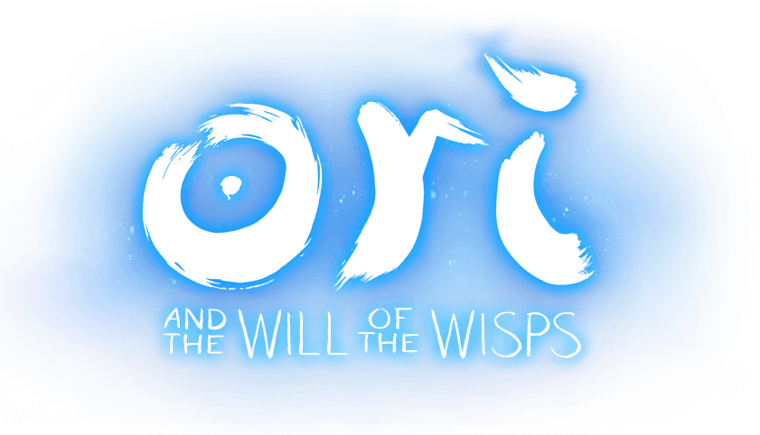

# GetOWotWSound v3.0.7

<p align="center">
  
</p>

> [一只橙叙原](https://space.bilibili.com/1684627521)、[立秋枫林晚](https://space.bilibili.com/701443748)

## 介绍
- 全称：Get Ori Will of the Wisps Sound
- 获取游戏音频资源目录内的音频文件（批量）
- 完全重构此项目，2.0.0 版本的所有功能都已移除，不再受支持
- 使用 [lks@0.0.7](https://github.com/thisNames/lks) 工具开发，终端操作更灵活、扩展性更高、可随时新增、移除功能
- 使用异步处理更快速

---

## 主要功能
- 将 StreamedFile（wem）文件转换成 ogg 文件
- 将 SoundBank （bnk）文件转换成 ogg 文件
- 搜索文件

---

## 运行环境
- 使用 javascript 脚本，nodejs 运行环境。不依赖任何第三方库，仅仅使用原生 node（建议使用 18x lts 版本）。

---

## 使用到的三方工具
### ww2ogg
- 路径：[SoundMod/ww2ogg-v0.24.exe](SoundMod)
- 将 .wem 转换成 .ogg 工具，项目已内置最新版本
- GitHub: https://github.com/hcs64/ww2ogg

### revorb
- 路径 [SoundMod/revorb-v1.exe](SoundMod)
- 将 .wem 转换出来的 .ogg 重编码的工具，项目已内置最新版本
- GitHub: https://github.com/ItsBranK/ReVorb

### bnkextr
- 路径：[SoundMod/bnkextr-v2.exe](SoundMod)
- 用于提取 .bnk 文件成 .wem 文件的工具，项目已内置最新版本
- GitHub: https://github.com/eXpl0it3r/bnkextr

---

## 使用：[wiki.git](wiki.git)

---

## 基本工作原理
- 从 SoundBanksInfo 中获取文件的定义
- bnkextr 工具从 bnk 文件中提取 wem 文件
- ww2ogg 工具将 wem 文件转换成普通的 ogg 文件
- revorb 将 ogg 文件重新编码

---

## 主要的文件
- Music & Sound Files

### StreamedFile 文件
- 类型：wem 文件
- 定义：所有的定义都在 SoundbanksInfo 中
- 数量：2425
- 实际数量：SoundBnkInfo.StreamedFiles 实际定义的数量是 2272
- json 结构：
```json
{
    "Id": "20302852",
    "Language": "SFX",
    "ShortName": "wotw\\howlsOrigin\\props\\portalExitHowlsOrigin_002.wav",
    "Path": "SFX\\wotw\\howlsOrigin\\props\\portalExitHowlsOrigin_002_A02A9068.wem"
}
```
#### 操作
- ww2ogg 工具将 wem 文件转换成普通的 ogg 文件
- revorb 将 ogg 文件重新编码

### SoundBank
- 类型：bnk 文件
- 定义：所有的定义都在 SoundbanksInfo 中（也有自己单独的定义文件）
- 数量：124
- 实际可用的 122
    * `act2grolsPlunge.bnk` => No WEM files discovered to be extracted
    * `persistent_eventsOnly.bnk` => No WEM files discovered to be extracted
- json 结构：
```json
{
    "Id": "13348331",
    "Path": "corruptSpiderling.bnk",
    "IncludedMemoryFiles": [
        {
            "Id": "6516071",
            "ShortName": "characters\\enemies\\corruptSpiderling\\corruptSpiderlingHitReactionSmall_003.wav",
            "Type": "SoundBanks",
            "BnkFile": "corruptSpiderling.bnk"
        },
        {
            "Id": "11777040",
            "ShortName": "characters\\enemies\\corruptSpiderling\\corruptSpiderlingBodyFall_008.wav",
            "Type": "SoundBanks",
            "BnkFile": "corruptSpiderling.bnk"
        }
    ]
}
```
#### 操作
- bnkextr 工具从 bnk 文件中提取 wem 文件
- ww2ogg 工具将 wem 文件转换成普通的 ogg 文件
- revorb 将 ogg 文件重新编码

### SoundBank 定义文件 .json
- 数量：126
#### SoundbanksInfo.json
- 包含所有 wem、bnk 的定义文件
- +1
#### PluginInfo.json
- 只是插件管理的定义文件（不是重点）
- +1
#### 剩余的 .json
- 每个单独 bnk 的定义文件
- +124

### SoundBank 定义文件 .xml
- 数量：126
#### SoundbanksInfo.xml
- 包含所有 wem、bnk 的定义文件
- +1
#### PluginInfo.xml
- 只是插件管理的定义文件（不是重点）
- +1
#### 剩余的 .xml
- 每个单独 bnk 的定义文件
- +124

---

## 生成说明
### 名称
```text
00000000_6516071_WaterDropsMultiLight_003.wav
```
### 可看成：A_B_C
#### A
- 随机生成的 8 位哈希 ID，用于保证输出数量的完整性
#### B
- SoundBanksInfo 定义的文件 ID
- 游戏音频资源目录里的文件名称（一般存在）。`id.wem`
- 不存在就是在 bnk 文件里
#### C
- 就是文件的名称了
- 以 SoundBanksInfo 定义的为准

---

## 备注
### 声明
- 提取出来的所有资源都属于游戏本身，严禁倒卖
- GetOWotWSound 不生产资源，只是资源的搬运工
### 运行
- 全屏 cmd 运行
- cmd 运行选中，如果被选中就会卡住暂停，只需要回车一下即可（windows cmd 特性属于了）
### 问题
- 关于有一些音频文件播放失败
- 显示文件已损坏，`未解决`，可能是解码工具不能正确解码导致
### 最后
- 本工具获取到所有的音频、音效文件。不包含游戏内的 100%。因为也不知游戏里有多少。（不包含 100%，也包含大部分了）
- 不同平台的游戏，可能出来的音频文件数量不一样。（但是基本大差不差）

<p align="center">
  
</p>